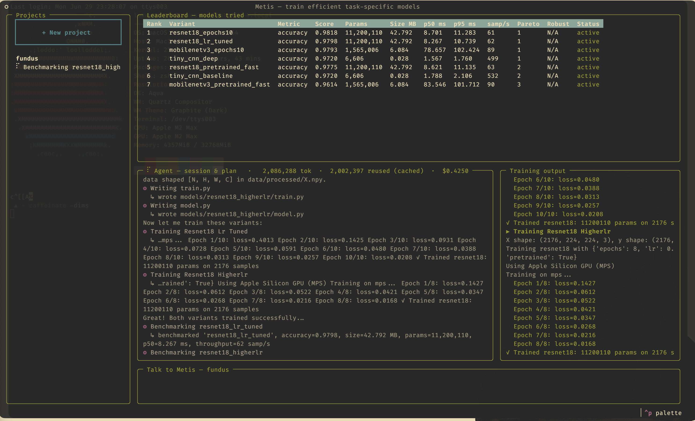

# Metis

> A knock at Greek mythology.

**Metis is an agent harness for training non-LLM models.** It is a terminal app
(TUI) that hands a frontier reasoning agent the tools to autonomously 
**design, train, benchmark, and refine compact, efficient task-specific models** — 
for almost anything you can classify or predict: fundus images, x-rays, flowers, 
birdsong, tabular records, and more.



You say *what* you want to predict and point at your data. The agent does the
rest: it proposes a breadth of candidate architectures (small CNNs,
MobileNet-class nets, ViT-tiny, gradient-boosted trees, classical ML…), trains
them within your budget, benchmarks them on accuracy **and** efficiency, prunes
the weak, and branches out when progress plateaus.

Metis is **not** a tool for training LLMs. The agent *is* an LLM; the models it
produces are not — they are small, fast classifiers and regressors you can ship.

### The core safety property

**The agent builds the models, but the harness grades them.** Benchmarks and the
holdout test set live in a sealed lockbox the agent's tools physically cannot read
or write. So the agent can't overfit the test set, edit the grader, or hard-code
answers — the anti-gaming guarantee Metis is built around.

### What makes a model "win"

Ranking is multi-metric by default (a Pareto frontier). A model is judged on its
task metric (accuracy, F1, AUROC…) **and** its efficiency: parameter count, size
on disk, inference latency, and throughput. A slightly less accurate model that is
100× smaller and faster often wins.

### For novices and experts alike

A novice states what they want to predict, drops in data, and never has to learn
what a "holdout" or a "train/val split" is — the harness handles it. An expert can
still control splits, seeds, architectures, hyperparameters, budgets, and ranking
objectives explicitly. Sensible defaults for the novice; full control for the
expert.

See **[CLAUDE.md](./CLAUDE.md)** for the full vision and design and
**[docs/ARCHITECTURE.md](./docs/ARCHITECTURE.md)** for how the pieces fit together.
Want to contribute? See **[CONTRIBUTING.md](./CONTRIBUTING.md)**.

---

## Install

Metis needs **Python 3.11+**. The recommended install uses
[`pipx`](https://pipx.pypa.io), which drops the `metis` command on your `PATH`
in its own isolated environment — no virtualenv to manage, works the same on
macOS, Linux, and Windows.

```bash
# Install pipx once (if you don't have it):
#   macOS:    brew install pipx && pipx ensurepath
#   Linux:    python3 -m pip install --user pipx && python3 -m pipx ensurepath
#   Windows:  py -m pip install --user pipx && py -m pipx ensurepath

# Install Metis (drives every LLM provider through litellm — no per-provider SDK):
pipx install "git+https://github.com/whatonlylue/Metis.git"

# Want real training too? Install with the ml extra:
pipx install "metis[ml] @ git+https://github.com/whatonlylue/Metis.git"      # torch / sklearn
```

Then run `metis --help` from any directory to confirm it's on your `PATH`.

> Prefer plain `pip`? `pip install "git+https://github.com/whatonlylue/Metis.git"`
> works too — just do it inside a virtual environment so the `metis` command
> doesn't collide with other tools.
>
> Contributing to Metis? Don't install the published package — **build from
> source** instead (editable install + dev tooling). See
> **[CONTRIBUTING.md](./CONTRIBUTING.md)**.

### Where Metis keeps your data

Everything personal to you lives under a single **`~/.metis/`** folder, created
on first use — the same location on every OS (`%USERPROFILE%\.metis` on Windows):

```
~/.metis/
├── projects/           # every project you create
├── credentials.json    # your API key (0600, owner-only, never logged)
├── model.json          # your chosen model string
└── ui.json             # TUI preferences (theme, …)
```

Because your projects and settings live here — not in the current directory —
you can run `metis` from anywhere and pick up right where you left off. Point
`METIS_HOME` at another path to relocate it (handy for keeping several isolated
setups).

### Pick a model and set a key

Press `m` in the TUI and type any [litellm](https://docs.litellm.ai/docs/providers)
model string — `anthropic/claude-opus-4-8`, `gpt-4o`, `gemini/gemini-1.5-pro`,
`ollama/llama3`, … The suggestion list reflects whichever provider key you already
have. Metis prefers no provider; you always choose.

Provide an API key in one of two ways:

```bash
export METIS_API_KEY=sk-...             # generic — used for whatever model you pick
export ANTHROPIC_API_KEY=sk-ant-...     # or the provider's own env var (litellm reads it)
export OPENAI_API_KEY=sk-...
```

…or just press `k` in the TUI and paste the key into the token manager (stored
locally, `0600`, never logged). One key drives whichever provider your chosen
model belongs to.

---

## Quick start

### 1. Scaffold a project

```bash
metis new fundus-grading
```

This creates `~/.metis/projects/fundus-grading/` with a `project.yaml`, the
`data/` tree, and the sealed `benchmark/` lockbox.

### 2. Add your data

Drop your data into the project's `data/` folder. Two paths:

- **Raw, to be ingested** → drop `X.npy` and `y.npy` into `data/raw/` (or a
  named subfolder like `data/raw/my-dataset/`) and let the harness de-dupe,
  validate, and split it:

  ```bash
  metis ingest fundus-grading
  # or, if you used a named subfolder:
  metis ingest fundus-grading --dataset my-dataset
  ```

- **Already preprocessed** → drop `X.npy` / `y.npy` straight into
  `data/processed/`.

Either way, the harness **automatically carves out and seals a holdout** into the
agent-invisible `benchmark/` lockbox *before* any training can happen. You never
have to think about a test set — and the agent can never see it.

### 3. Describe the task in `project.yaml`

Open `~/.metis/projects/fundus-grading/project.yaml` and fill in what you want. The fields
you'll most likely touch:

```yaml
name: fundus-grading
description: Grade diabetic retinopathy severity from fundus images   # plain language
task_type: image_classification      # or tabular_classification, audio_classification, regression
classes: [none, mild, moderate, severe, proliferative]   # omit for regression
target_metric: accuracy              # accuracy, f1, auroc, mAP, …
rank_objective: pareto               # pareto | accuracy | weighted
data_provided: true

budgets:
  max_wall_clock_minutes: 30         # the harness enforces this — not the agent
  max_variants: 12
  max_dollars: 5.0

data:
  split: { train: 0.7, val: 0.15, test: 0.15 }   # test is sealed as the holdout
  split_seed: 42
```

Everything has sensible defaults — a novice can leave most of it untouched; an
expert can tune splits, budgets, prune/plateau policies, robustness corruptions,
and export settings.

### 4. Run it

```bash
metis run
```

This launches the TUI. Pick your project on the left, then talk to the agent in
the chat box ("get started", "try a smaller model", "what's winning?"). Watch the
live leaderboard fill in with accuracy + efficiency columns as candidates train
and get benchmarked. Press `m` to choose/switch the driving model, `k` to manage
your API token, `t` to change theme, `q` to quit.

> Prefer the command line? `metis --help` lists the non-interactive commands
> (`seal`, `ingest`, `benchmark`, `prune`, `budget`, `export`, `bundle`, …).
